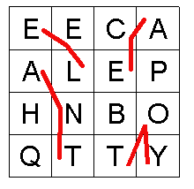
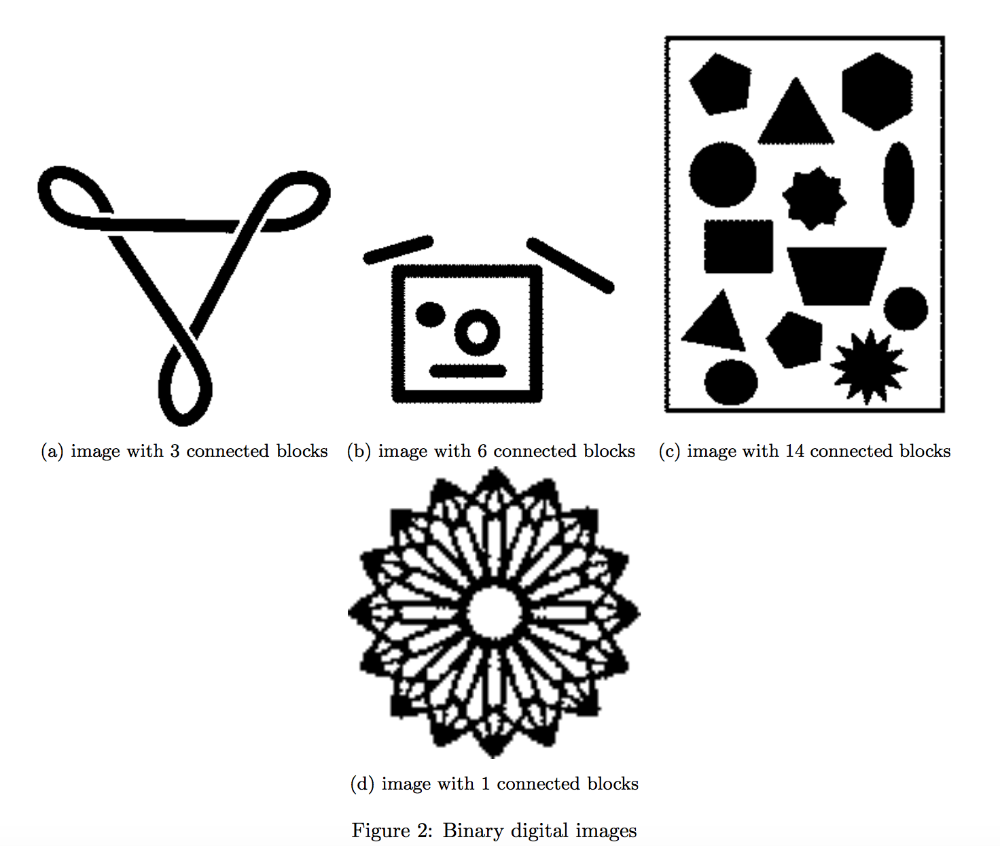

# Project: Recursion 

# Overview
Completed a series of recursive functions in the classes given to you. 

# Objectives
Familiarization with recursive functions and recursive problem solving.

# Boggle Game Class
Boggle is a game where each player tries to find words in a grid of letters. The words are constructed so each letter in the word is adjacent to the next letter on the grid. You may not use the same cell on the grid more than once when constructing a word. See the figure bellow. 


## Usefull Class definitions

LetterGrid.java - holds the grid for the boggle game in a char[][].
                  Has a few methods which may be useful. Read through it.  

Picture.Java - Holds the picture for the ImageBlocks Class. 
Has a get(x,y) and a set(x,y) which can be used to set the color of a pixel.  

SimpleGrid.java - simple class that holds a test for Boggle

## Boggle Class

### instance variables

`LetterGrid grid` - The object that holds the letters.   
`Stack<String> path` - A stack object that stores the path of a word. 
`boolean[][] visited` - Tracking if you visited a cell or not. 

## ImageBlocks Class
The ImageBlocks class takes in a black and white picture with various shapes and continuous black blocks. 

### instance variables
`private int height` - An integer representing how many pixels are in the `pic`'s height.  
`private int width` - An integer representing how many pixels are in the `pic`'s width.  
`boolean[][] visited` - Tracking if you visited a cell or not.  
`Picture pic` - The Picture you are analyzing. Pixels in the image are either black or white

### functions to implement 
```java
public int CountConnectedBlocks()
/*
* @return - The number of connected blocks in the binary digital image found in 'pic'
* Connected blocks are black.
*/
```
For example, a black and white image with two separate black squares has two blocks and so the function will return 2. See the examples bellow:


```java
public Picture delete(int x, int y)
/*
* @param x - the x coordinate of the pixel in question
* @param y - the y coordinate of the pixel in question
* @return - the updated image.
* You will be deleting the entire connected block which contains the pixel (x,y)
* If (x,y) is not a black pixel, nothing should happne
* You can use pic.set(x,y, COLOR) to set a pixel's color of the 'pic' object.
* You should be modifying the 'pic' object, not creating a new one.
*/
```

## crop
```java
public Picture crop(int x_start, int x_end, int y_start, int y_end) {
/*
* @param x_start - the starting x coordinate 
* @param x_end - the ending x coordinate 
* @param y_start - the starting x coordinate 
* @param y_end  - the ending y coordinate
* @return - the updated image.
* Similar to delete, but you will be deleting all black pixesl outside of the bounds
* Bounds are inclusive, so do not delete anything that is on the border
* You can use pic.set(x,y, COLOR) to set a pixel's color of the 'pic' object.
* You should be modifying the 'pic' object, not creating a new one.
*/
```
Given a list of bounds, this function sets all black pixels outside of the bounds to white. The actual size of the image should not be changed.
